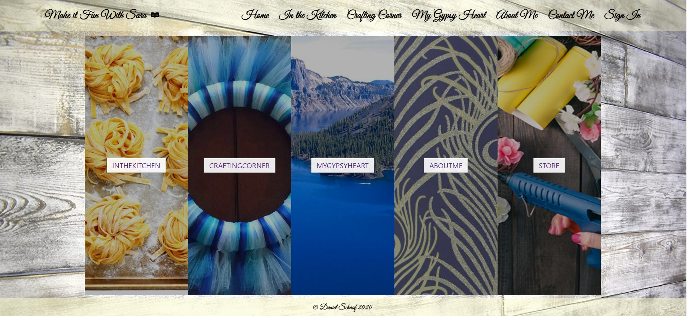

<br>
<p align="center">
  <u><big>|| <b>Making it Fun with Sara</b> ||</big></u>
</p>
<p align="center">
    <!-- Project Avatar/Logo -->
    <br>
     <a href="https://github.com/dschaaf89/capstone">
         
    </a>
    </a>
    <p align="center">
      ___________________________
    </p>
    <!-- GitHub Link -->
    <p align="center">
        <a href="https://github.com/dschaaf89">
            <strong>Daniel Schaaf</strong>
        </a>
    </p>
    <!-- Project Shields -->
    <p align="center">
        <a href="https://github.com/dschaaf89/capstone/graphs/contributors">
            
        </a>
        ¨
        <a href="https://github.comdschaaf89/capstone/stargazers">
            
        </a>
        ¨
        <a href="https://github.com/dschaaf89/capstone/issues">
            
        </a>
    </p>
</p>
<p align="center">
  <small>Initiated 12/11/2020.</small>
  <small>Edited on 12/23/2020.</small>
</p>

<!-- Project Links -->
<p align="center">
    <a href="https://github.com/dschaaf89/capstone"><big>Project Docs</big></a> ·
    <a href="https://github.com/dschaaf89/capstone/issues"><big>Report Bug</big></a> ·
    <a href="https://github.com/dschaaf89/capstone/issues"><big>Request Feature</big></a>
</p>
------------------------------

### <u>Table of Contents</u>
* <a href="#🌐-about-the-project">About the Project</a>
    * <a href="#📖-description">Description</a>
    * <a href="#🦠-known-bugs">Known Bugs</a>
    * <a href="#🛠-built-with">Built With</a>
    <!-- * <a href="#🔍-preview">Preview</a> -->
* <a href="#🏁-getting-started">Getting Started</a>
    * <a href="#📋-prerequisites">Prerequisites</a>
    * <a href="#⚙️-setup-and-use">Setup and Use</a>
* <a href="#🤝-contributors">Auxiliary</a>
    * <a href="#🤝-contributors">Contributors</a>
    * <a href="#✉️-contact-and-support">Contact</a>
    * <a href="#⚖️-license">License</a>
    * <a href="#🌟-acknowledgements">Acknowledgements</a>
    
------------------------------
## 🌐 About the Project

### 📖 Description

This React-Redux website was built in collaboration with my wife. She was telling me back in october and november that she wanted a site and started telling me every detail that would be great. It was during this time that she also decided that she wanted to have a streaming platform and future versions of this site will have her videos of all the projects, recipes and videos for her travel blog. 


### 🦠 Known Bugs

* no known bugs at this time


### 🛠 Built With
* [Visual Studio Code](https://code.visualstudio.com/)
* [React](https://reactjs.org/docs/getting-started.html)
* HTML
* CSS
* Bootstrap
* REDUX
* Firebase


<!-- ### 🔍 Preview -->

------------------------------

## 🏁 Getting Started/Design Process
 Here is what the whole process started out like. the ideas that i had and my design and though process during the project. 
#### Daniel Schaaf	

#### Sara’s Corner

##### Description:
This project was an idea my wife came up with as she aspires to be a crafting and Recipe Content Creator and came up with this idea as she was scrolling thru hundreds of recipe and crafting sites. Her and her friends hate having to comb thru stories just to get to the good stuff such as recipe’s and instructions on how to make certain things either crafting or in the kitchen. So she wants to start a new trend. The recipe and the steps first then a story about the product or video.

##### Use Case
The main use for this website would be for those who want to learn how to make something craftwise or in the kitchen. What my wife says is that it will bring a midwestern charm to life in the City. the Simplistic of it all. Problems that i might face are creating a dynamic form so that she can add bigger recipe’s that need lots of ingredients or steps to make a crafting idea. Also being able to upload pics and video to a page. (Who are the main users? What problems are they facing that you will solve? What will it do for users? What is the purpose/goal of the project?)

##### Minimum Viable Product
(List the absolute minimum features the project requires before it is considered in a pre-alpha state)
Minimum viable product would be the splash page and ability to add crafting procedure and lists of items in it, or ingredients and cooking steps.##### Tools for MVP
(List the tools, frameworks, libraries, APIs, modules, resources, languages, etc that will be used to create your MVP. Be specific.)
 *React and JavaScript most likely. I might make it out of C# MVC but i think this is better suited for React and JavaScript.


##### Additional Features
(If you finish developing your MVP and have time to spare, what features do you want to work on next? Be specific.)
Additional features would be to create a supporters section where registered users could go and get more in-depth knowledge on a project or recipe.
 Pictures for each including the ability to upload a picture or video of the steps. And it be added to the right recipe or crafting area.

Ability to 
##### Tools for Additional Features
(List the tools, frameworks, libraries, APIs, modules, resources, languages, etc that will be used to create your additional features. Be specific.)
 * might need a mySql database for photos and video urls to link them to recipe or crafting projects.
 *
 *

##### Additional Information

This project is based off the wants my wife wants for her website. She wants me to create a site her and her friends have been wanting to visit for sometime now. She is getting into the content creating market so we came up with the plan to include that idea with her content creation so she can market herself as well as for people to get recipes and crafting steps with out having to read stories first.


reasearch for Capstone.
Sat Down with Sara Schaaf. Talked to her about what she wanted for her site. made a site diagram 
(picture will go here )

list of wants
simple splash page of buisness. 
tabs for recipes,crafts,travel,about me/contact us
will eventually add a ecommerce to site so she can sell her crafts thru it.

backgrounds likes the look of Shiplack. 
she wants to bring a flair of southern charm to the city. she is from the midwest.
wants a kind of chalkboard looking ingredient list. think southern. maybe like those chalk labels for jars and stuff

needs forms to enter in the ingredients and recipe instructions. so need backend database to hold. 

wants a navbar at the top to change between the different aspects of page.


doing research on how to make custom Navbar in react.


11:58
Switched computers so i cloned repository and this is first commit.

fab fa-readme
https://www.youtube.com/watch?v=fL8cFqhTHwA


looking into hosting of website. 


looking into how i want to do the recipe ingredients and instructions form intake since all recipe's having diferent amount of ingredients and steps to complete.


Customer said she wants to be able to query lets say Breakfast and a list of breakfast recipe's will come up etc.

trying to figure out how to store the different lists in firebase too

found this thru google on helping make a dynamic form thru google https://dev.to/kahawaiikailana/creating-a-react-dynamically-controlled-form-5dcc

https://goshakkk.name/array-form-inputs/ more research 

researching Contact us mail smtp transfer using firebase. good little read https://pantaley.com/blog/How-to-integrate-Serverless-contact-form-using-Firebase-Cloud-functions-in-React/

https://pantaley.com/blog/How-to-integrate-Serverless-contact-form-using-Firebase-Cloud-functions-in-React/


Friday 12/18
hard to concentrate this morning. opened the project in the state i left it, and it was not working on the add or edit parts of the craft forms. started working on about me and contact forms. started researching how to make a ecommerce site attached to this site so customer could sell their crafts on it. 

https://www.youtube.com/watch?v=7gQay39krqY


since i was having a hard day today concentrating on backend work i worked on the front end splash page or home page. it turned out better then i thought it would. 

needs still to get to MVP

routeing
contact page
about me page
better styling of the recipes/crafts

added to what would like to have. a full on Store to sell crafts on.


12/19
I started the day off rough, had an error so i went back a couple of commits and fixed it. then took some time to figure out how to do file uploads to firebase. going to try to get my forms able to upload photos for recipes and crafts to firebase so i could just call the database for the photos instead of storing them in the project.
https://www.youtube.com/watch?v=8r1Pb6Ja90o


12/21
researching css styles from 220 -3pm.


### 📋 Prerequisites
1. Clone this repository onto your computer:
    "git clone https://github.com/dschaaf89/capstone"
2. Navigate into the "capstone" directory in Visual Studio Code or preferred text editor:
3. Open the project by typing "code ." while in the previous directory in your terminal.
4. Open your computer's terminal and navigate to the directory bearing the name of the program and containing the top level subdirectories and files.
5. Type "npm install" in your console to install necessary dependencies and allow use of the following scripts.

This project was bootstrapped with [Create React App](https://github.com/facebook/create-react-app).

## Available Scripts

In the project directory, you can run:

### `npm start`

Runs the app in the development mode.<br />
Open [http://localhost:3000](http://localhost:3000) to view it in the browser.

The page will reload if you make edits.<br />
You will also see any lint errors in the console.

### `npm test`

Launches the test runner in the interactive watch mode.<br />
See the section about [running tests](https://facebook.github.io/create-react-app/docs/running-tests) for more information.

### `npm run build`

Builds the app for production to the `build` folder.<br />
It correctly bundles React in production mode and optimizes the build for the best performance.

The build is minified and the filenames include the hashes.<br />
Your app is ready to be deployed!

See the section about [deployment](https://facebook.github.io/create-react-app/docs/deployment) for more information.

### `npm run eject`

**Note: this is a one-way operation. Once you `eject`, you can’t go back!**

If you aren’t satisfied with the build tool and configuration choices, you can `eject` at any time. This command will remove the single build dependency from your project.

Instead, it will copy all the configuration files and the transitive dependencies (webpack, Babel, ESLint, etc) right into your project so you have full control over them. All of the commands except `eject` will still work, but they will point to the copied scripts so you can tweak them. At this point you’re on your own.

You don’t have to ever use `eject`. The curated feature set is suitable for small and middle deployments, and you shouldn’t feel obligated to use this feature. However we understand that this tool wouldn’t be useful if you couldn’t customize it when you are ready for it.

## Learn More

You can learn more in the [Create React App documentation](https://facebook.github.io/create-react-app/docs/getting-started).

To learn React, check out the [React documentation](https://reactjs.org/).

### Code Splitting

This section has moved here: https://facebook.github.io/create-react-app/docs/code-splitting

### Analyzing the Bundle Size

This section has moved here: https://facebook.github.io/create-react-app/docs/analyzing-the-bundle-size

### Making a Progressive Web App

This section has moved here: https://facebook.github.io/create-react-app/docs/making-a-progressive-web-app

### Advanced Configuration

This section has moved here: https://facebook.github.io/create-react-app/docs/advanced-configuration

### Deployment

This section has moved here: https://facebook.github.io/create-react-app/docs/deployment

### `npm run build` fails to minify

This section has moved here: https://facebook.github.io/create-react-app/docs/troubleshooting#npm-run-build-fails-to-minify
 #### Code Editor

  To view or edit the code, you will need an code editor or text editor. The popular open-source choices for an code editor are Atom and VisualStudio Code.

  1) Code Editor Download:
     * Option 1: [Atom](https://nodejs.org/en/)
     * Option 2: [VisualStudio Code](https://www.npmjs.com/)
  2) Click the download most applicable to your OS and system.
  3) Wait for download to complete, then install -- Windows will run the setup exe and macOS will drag and drop into applications.
  4) Optionally, create a [GitHub Account](https://github.com)

### ⚙️ Setup and Use

1. Clone this repository onto your computer:
    "git clone https://github.com/dschaaf89/capstone"
2. Navigate into the "capstone" directory in Visual Studio Code or preferred text editor:
3. Open the project by typing "code ." while in the previous directory in your terminal.
4. Open your computer's terminal and navigate to the directory bearing the name of the program and containing the top level subdirectories and files.
5. Type "npm install" in your console to install necessary dependencies and allow use of the following scripts.

This project was bootstrapped with [Create React App](https://github.com/facebook/create-react-app).


### 🤝 Contributors

| Author | GitHub | Email |porfolio|
|--------|:------:|:-----:|:-----:|
| [Daniel Schaaf](https://linkedin.com/in/danielschaaf) | [dschaaf89](https://github.com/dschaaf89) |  [Daniel.schaaf@outlook.com](mailto:Daniel.schaaf@outlook.com) |danielschaaf.com|


------------------------------

### ✉️ Contact and Support

If you have any feedback or concerns, please contact me at daniel.schaaf@outlook.com

------------------------------

### ⚖️ License

This project is licensed under the [MIT License](https://opensource.org/licenses/MIT). Copyright (C) 2020 Daniel Schaaf All Rights Reserved.
```
MIT License

Copyright (c) 2020 **_Daniel Schaaf_**

Permission is hereby granted, free of charge, to any person obtaining a copy
of this software and associated documentation files (the "Software"), to deal
in the Software without restriction, including without limitation the rights
to use, copy, modify, merge, publish, distribute, sublicense, and/or sell
copies of the Software, and to permit persons to whom the Software is
furnished to do so, subject to the following conditions:

The above copyright notice and this permission notice shall be included in all
copies or substantial portions of the Software.

THE SOFTWARE IS PROVIDED "AS IS", WITHOUT WARRANTY OF ANY KIND, EXPRESS OR
IMPLIED, INCLUDING BUT NOT LIMITED TO THE WARRANTIES OF MERCHANTABILITY,
FITNESS FOR A PARTICULAR PURPOSE AND NONINFRINGEMENT. IN NO EVENT SHALL THE
AUTHORS OR COPYRIGHT HOLDERS BE LIABLE FOR ANY CLAIM, DAMAGES OR OTHER
LIABILITY, WHETHER IN AN ACTION OF CONTRACT, TORT OR OTHERWISE, ARISING FROM,
OUT OF OR IN CONNECTION WITH THE SOFTWARE OR THE USE OR OTHER DEALINGS IN THE
SOFTWARE.
```

------------------------------

### 🌟 Acknowledgments

#### [Epicodus](https://www.epicodus.com/)
>"A school for tech careers... to help people learn the skills they need to get great jobs."

#### [The Internet](https://lh3.googleusercontent.com/proxy/6QlFHq-RHi9-Jd7pjdpwFdWMTYy5y26LesKZG-TO7rD3ZCh2BESLUzktpd27TAXSiGd19f8B3AxMn5Nbos1g6QCHAQOTrvVsAVnqS7RKSCQLV6s)
> "...The Internet is becoming the town square for the global village of tomorrow..."
> - Bill Gates

------------------------------

<center><a href="#">Return to Top</a></center>


